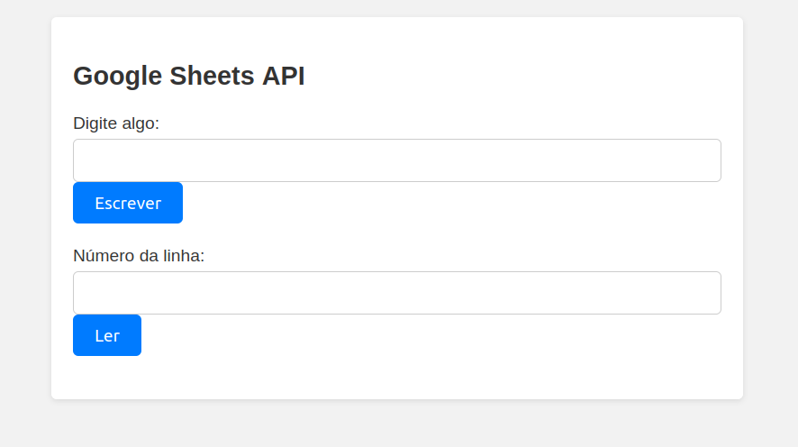
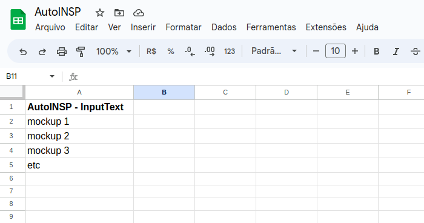
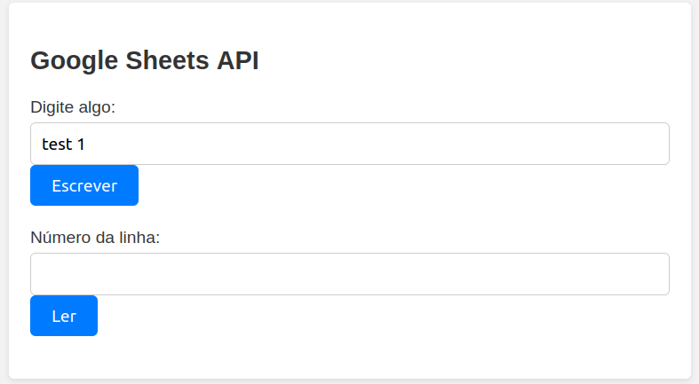
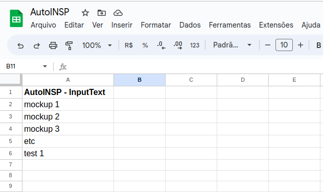
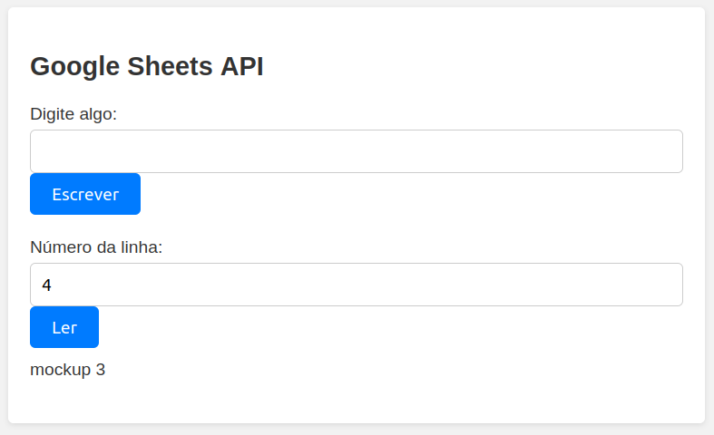

# GoogleSheetsAPI
Planilha em google sheets simples com somente uma coluna de nome "AutoINSP - InputText". 
1. Formulário de envio que preencha informações na tabela. 
2. Campo de pesquisa pelo número da linha, que retorna o valor do campo naquela linha. Utiliza-se a API do Google Sheets para tal.

## Tutorial

### Setup 

Para se utilizar a API do google sheet foi criado um backend em 
node.js utilizando o express, então é necessário fazer algumas configurações
iniciais para ter acesso a funcionalidade em completo. 

No diretório, entre o seguinte comando: 

```
npm init -y 
npm install –save googleapis express nodemon
```

Então você pode rodar o servidor express utilizando o comando 

```
npx nodemon
```

ou qualquer runner de backend de sua preferência.
O aplicativo está configurado para rodar na porta padrão 8080.

Assim que o comando for rodado com sucesso, a aplicação se encontra 
no "http://localhost/8080" se rodada localmente.

Ao entrar neste URL, o usuário terá acesso ao frontend da aplicação. 

### Tela inicial



### Escrevendo na planilha



### Lendo da planilha



